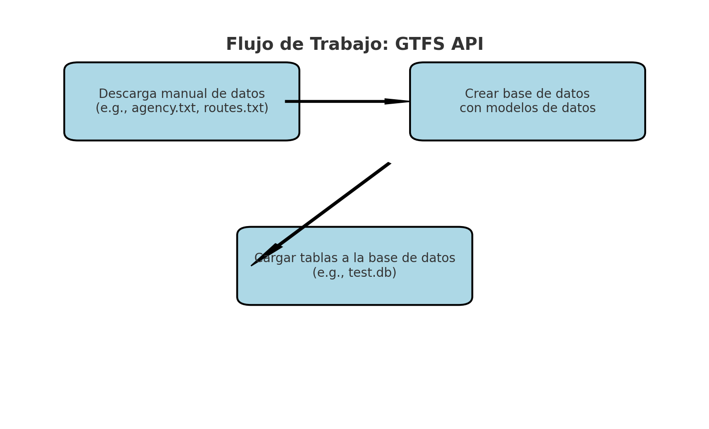
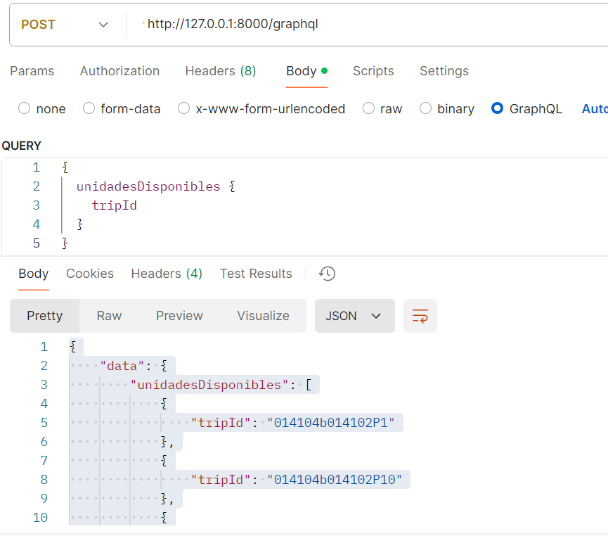

# **GTFS Data API**

Este proyecto es una API basada en **FastAPI** y **GraphQL** para interactuar con datos GTFS (General Transit Feed Specification). Permite consultas sobre rutas, unidades, ubicaciones y paradas de transporte público, cargando los datos desde archivos GTFS estáticos.

## **Características**

- **API GraphQL**:
  - Consultar unidades disponibles.
  - Obtener ubicaciones de una unidad por su ID.
  - Listar alcaldías disponibles.
  - Obtener paradas disponibles en una alcaldía.

- **Carga de datos GTFS**:
  - Importación automática de archivos GTFS en una base de datos SQLite.
  - Verificación de existencia de la base de datos antes de realizar la inicialización.

## **Estructura del Proyecto**

```plaintext
project/
├── app/
│   ├── main.py              # Archivo principal para ejecutar la API
│   ├── schema.py            # Definición de esquemas GraphQL
│   ├── database.py          # Configuración de la base de datos
│   ├── models.py            # Modelos SQLAlchemy para GTFS
├── scripts/
│   ├── initialize_db.py     # Script para cargar los datos GTFS en la base de datos
│   └── data/
│       ├── agency.txt
│       ├── calendar.txt
│       ├── calendar_dates.txt
│       ├── feed_info.txt
│       ├── routes.txt
│       ├── shapes.txt
│       ├── stops.txt
│       ├── stop_times.txt
│       ├── trips.txt
├── Dockerfile               # Configuración del contenedor Docker
├── docker-compose.yml       # Configuración de servicios para Docker Compose
├── requirements.txt         # Dependencias del proyecto
└── README.md
```
## **Requisitos**
Python 3.10+
Docker y Docker Compose (para el despliegue)

## **Uso con Docker**
Construye y levanta los contenedores:
```plaintext

bash
docker-compose up --build
```
La API estará disponible en http://localhost:8000/graphql.
## **Consultas GraphQL**

**Unidades Disponibles**
```plaintext

query {
  unidadesDisponibles {
    tripId
  }
}
```

**Ubicaciones de una Unidad dada**

```plaintext

query {
  ubicacionesPorUnidad(tripId: "fc73eb8fc73e9P4") {
    shapePtLat
    shapePtLon
  }
}
```


**Alcaldias disponibles**
```plaintext

query {
  alcaldiasDisponibles {
    shapeId
  }
}


```
**Paradas por Alcaldía**
```plaintext
query {
  paradasPorAlcaldia(shapeId: "19499") {
    stopName
    shapeId
  }
}

```
